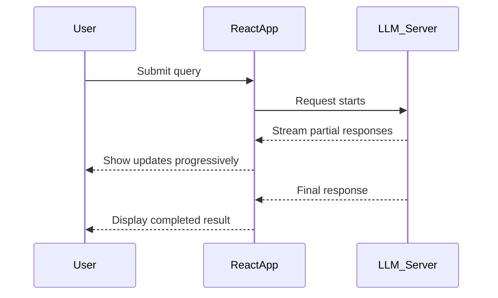
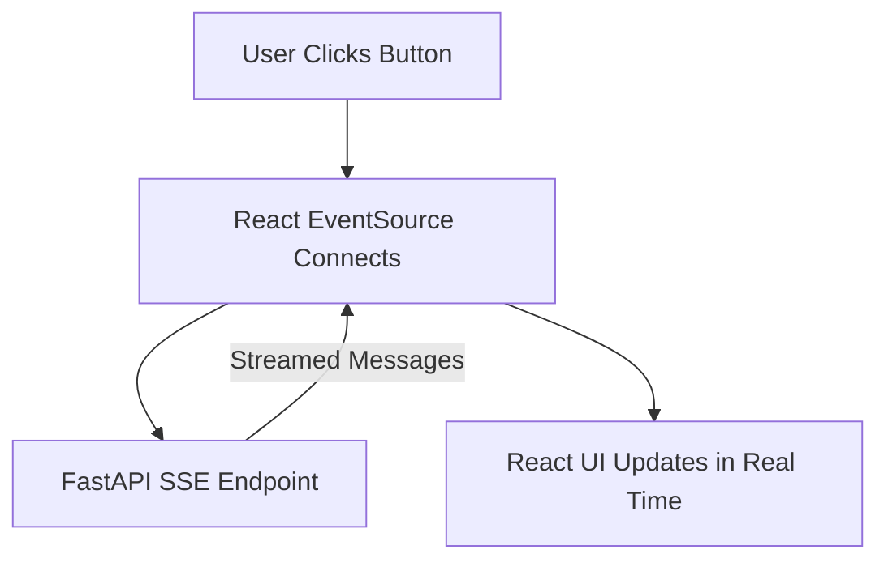

# Consuming Server-Sent Events (SSE) in React

Hello everyone 👋 — it’s been a while since my last blog, but I’m back with fresh learnings to share. I recently wrapped up my final semester of a **Master’s in Machine Learning and Artificial Intelligence** at [BITS Pilani](https://bits-pilani-wilp.ac.in/bitspilani-campaign/campaign-SEM1/b-tech-artificial-intelligence-and-machine-learning.php).

This journey gave me the chance to work with brilliant colleagues, make lifelong friends, and dive deep into fascinating topics.

In this post, we’ll explore **Server-Sent Events (SSE)** in React — why they exist, what problems they solve, and how they compare to REST, GraphQL, and WebSockets. Finally, we’ll build a small **FastAPI + React demo** to see SSE in action.

---

## Why SSE When We Already Have REST, GraphQL, and WebSockets?

Technology evolves quickly. REST APIs once ruled, then GraphQL entered the scene, and WebSockets gave us real-time bi-directional communication. So why introduce yet another approach?

The short answer: **SSE is about streaming — but in a simple, uni-directional way**.

Before comparing, let’s first ask: _Why is streaming important in modern applications?_

---

## Why Do We Need Streaming Responses?

Think of modern **LLM-powered applications**. They aren’t doing small database lookups — they’re performing:

- Heavy computations
- Multi-step agentic reasoning
- Resource-intensive tasks

If you only rely on REST or GraphQL, the client waits… and waits… staring at a **never-ending spinner**.

That’s a poor user experience.

**Streaming fixes this**:  
Instead of waiting for the entire response, the server streams progress updates so the user sees something happening _in real time_.



> **Takeaway:** Streaming creates contextual, intuitive experiences instead of “blank screens with spinners.”

---

## Then Why SSE? Why Not WebSockets or WebRPC?

- **WebSockets / WebRPC** → Designed for **bi-directional** communication (server ↔ client).
- **SSE** → Designed for **uni-directional** communication (server → client).

For LLM scenarios, we mostly care about **server updates flowing to the client**. We don’t need the client continuously streaming back.

So while WebSockets _can_ do the job, it’s **overkill**. SSE fits perfectly.

---

### What is Uni-Directional Streaming?

In simpler terms:

- **LLM → Frontend:** “Here’s the next token… here’s the next chunk… done.”
- **Frontend → LLM:** Occasional request, not continuous chatter.

```mermaid
flowchart LR
    A[Client (React App)] -- Request --> B[Server (LLM Engine)]
    B -- Stream Updates --> A
```

That’s it. One-way communication. Lightweight, efficient, and easier to implement compared to sockets.

---

## Why SSE is a Sweet Spot

- ✅ **Lightweight**: No socket handshakes or complex protocols
- ✅ **Built-in to HTTP**: SSE uses simple HTTP connections
- ✅ **Perfect for LLM streaming**: Fits the exact uni-directional requirement
- ✅ **Fallback-friendly**: Works better with firewalls and proxies compared to WebSockets

> **In short:** SSE gives you streaming without the baggage of full-duplex WebSockets.

---

## How to Do Streaming in React

We’ll build a small **FastAPI backend** and a **React frontend** to see SSE in practice.

---

### Step 1: Backend Setup (FastAPI)

```python
# app/routes/stream_example.py
from __future__ import annotations
import asyncio, json
from datetime import UTC, datetime
from typing import Any
from collections.abc import AsyncGenerator
from fastapi import APIRouter, Request
from sse_starlette.sse import EventSourceResponse

router = APIRouter(prefix="/stream_example", tags=["stream_example"])

stream_payload = [
    "This is a streamed message.",
    "Here's another message.",
    "Streaming data is fun!",
    "FastAPI makes it easy.",
    "This is the last message.",
]

async def _event_generator(request: Request) -> AsyncGenerator[dict[str, Any], None]:
    yield {"event": "info", "data": "connected", "retry": 10_000}

    for i in range(1, 6):
        if await request.is_disconnected():
            break
        payload = {
            "message": stream_payload[i - 1],
            "time": datetime.now(UTC).isoformat(),
        }
        yield {"event": "message", "id": str(i), "data": json.dumps(payload)}
        await asyncio.sleep(1)

    yield {"event": "end", "data": "done"}

@router.get("")
async def stream(request: Request) -> EventSourceResponse:
    return EventSourceResponse(_event_generator(request), ping=15)
```

Every second, the server pushes a new message until the stream ends.

---

### Step 2: Basic React Component

```javascript
const ServerSideEvent = () => {
	return <div>ServerSideEvent</div>;
};
export { ServerSideEvent };
```

---

### Step 3: Add State

```javascript
import React from "react";

const ServerSideEvent = () => {
  const [messages, setMessages] = React.useState<string[]>([]);
  return (
    <div>
      <h1>Server-Sent Events</h1>
      {messages.map((msg, idx) => <div key={idx}>{msg}</div>)}
    </div>
  );
};
export { ServerSideEvent };
```

---

### Step 4: Add Button + Styling

```javascript
const onGetMessage = () => {
	/* will connect to SSE */
};

<button
	onClick={onGetMessage}
	className="bg-indigo-600 hover:bg-indigo-700 text-white font-semibold py-3 px-6 rounded-lg shadow-md"
>
	Get Messages
</button>;
```

---

### Step 5: Connect with EventSource

Key things to keep in mind:

1. Clear old messages before connecting
2. Prevent multiple requests with a `loading` flag
3. Listen for events with `.onmessage`
4. Handle stream end gracefully

```javascript
eventSource.onmessage = (event) => {
	const parsedData = JSON.parse(event.data);
	if (parsedData.message) {
		setMessages((prev) => [...prev, parsedData.message]);
	}
};
```

---

### Step 6: Complete React Component

```javascript
import React from "react";

const ServerSideEvent = () => {
  const [messages, setMessages] = React.useState<string[]>([]);
  const [loading, setLoading] = React.useState(false);
  const [progressInfo, setProgressInfo] = React.useState<string | null>(null);

  const onGetMessage = () => {
    setMessages([]);
    const eventSource = new EventSource("http://localhost:8000/v1/stream_example");
    setLoading(true);

    eventSource.onmessage = (event) => {
      const parsedData = JSON.parse(event.data);
      if (parsedData.message) {
        setMessages((prev) => [...prev, parsedData.message]);
      }
    };

    eventSource.onerror = (error) => {
      console.log("EventSource failed: ", error);
      eventSource.close();
      setProgressInfo("Connection closed - " + JSON.stringify(error));
      setLoading(false);
    };

    eventSource.addEventListener("end", (event) => {
      setProgressInfo("Stream ended - " + JSON.stringify(event));
      console.log("Stream ended: ", event);
      eventSource.close();
      setLoading(false);
    });

    eventSource.onopen = () => {
      setProgressInfo("Connection opened");
    };
  };

  return (
    <div className="min-h-screen bg-gradient-to-br from-blue-50 to-indigo-100 p-8">
      <div className="max-w-2xl mx-auto">
        <h1 className="text-4xl font-bold text-gray-800 mb-6">
          Server-Sent Events
        </h1>

        {!loading && (
          <button
            onClick={onGetMessage}
            className="bg-indigo-600 hover:bg-indigo-700 text-white font-semibold py-3 px-6 rounded-lg shadow-md mb-4"
          >
            Get Messages
          </button>
        )}
        {progressInfo && <div className="text-sm text-gray-500 mb-2">{progressInfo}</div>}

        <div className="space-y-3">
          {messages.map((msg, idx) => (
            <div key={idx} className="bg-white p-4 rounded-lg shadow-sm border border-gray-200 text-gray-700">
              {msg}
            </div>
          ))}
        </div>
      </div>
    </div>
  );
};

export { ServerSideEvent };
```

---

## End-to-End SSE Flow



---

## Wrap-Up

That’s it 🎉 — a complete walkthrough of **Server-Sent Events (SSE) in React** with a FastAPI backend.

✅ Perfect for streaming long responses (e.g., LLM outputs, logs, progress updates)
❌ Not ideal for two-way chat (better with WebSockets)

> **SSE = the sweet spot for simple, one-way streaming.**

Thanks for reading! If you have any questions, feel free to reach out in the comments on my YouTube videos.

---
